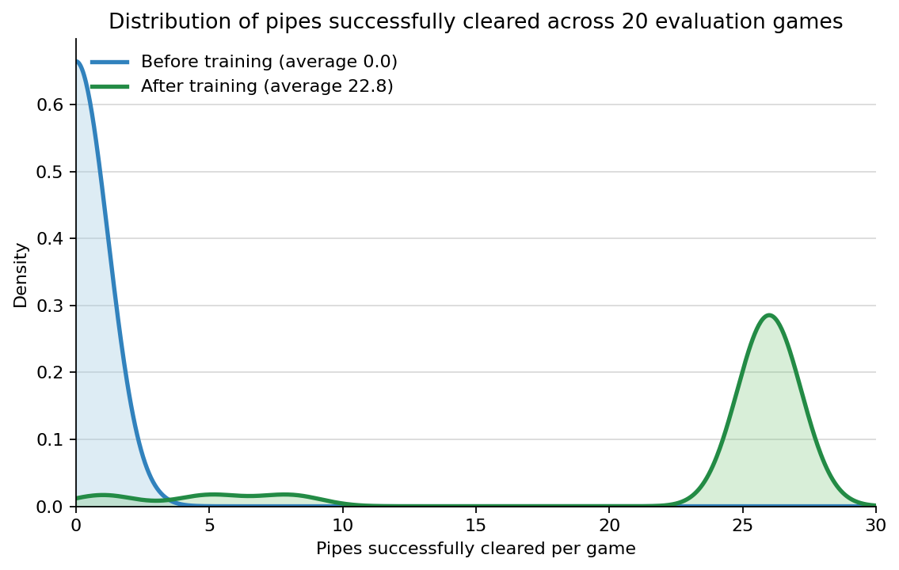

# Flappy Bird: From Tabular to Deep Q-Learning

Follow this repository to learn reinforcement learning from first principles. Start with simple tabular Q-learning, learn about the Flappy Bird environment, and finish by training a deep Q-network (DQN) to play Flappy Bird using image pixels. 

## Learning to Fly

### Before training


- Episode reward: `0.72`
- Average pipes successfully cleared per game (20 games): `0.0`

### After training


- Episode reward: `149.12`
- Average pipes successfully cleared per game (20 games): `22.8`

### Before vs after training



## Learning path

### Stage 1 — Tabular Q-learning

Learn the reinforcement-learning loop—agents, environments, states, actions, rewards, returns, policies, value functions, Markov decision processes (MDPs), Bellman reasoning, exploration, and Q-learning updates—in a small hallway environment.

- Hands-on notebook: [`01_tabular_q_learning/01_tabular_q_learning.ipynb`](01_tabular_q_learning/01_tabular_q_learning.ipynb)
- Theoretical notes: [`01_tabular_q_learning/01_learning_notes.md`](01_tabular_q_learning/01_learning_notes.md)

### Stage 2 — Understanding visual and temporal data

Use a lightweight Flappy Bird-style environment to understand video-like observations as sequences of image frames. Focus on how pixels encode visual information over time: transform each `84 × 84` RGB frame into a normalized `42 × 42` grayscale image and stack four consecutive frames so a neural network can infer motion and temporal context.

- Hands-on notebook: [`02_intro_to_flappy_bird/02_intro_to_flappy_bird.ipynb`](02_intro_to_flappy_bird/02_intro_to_flappy_bird.ipynb)
- Theoretical notes: [`02_intro_to_flappy_bird/02_learning_notes.md`](02_intro_to_flappy_bird/02_learning_notes.md)

### Stage 3 — Deep Q-learning 

Replace the Q-table with a deep Q-network (DQN). Its convolutional neural network (CNN) reads the frame stack and estimates the Q-values of `do nothing` and `flap`.

- Hands-on notebook: [`03_deep_q_learning/03_deep_q_learning.ipynb`](03_deep_q_learning/03_deep_q_learning.ipynb)
- Theoretical notes: [`03_deep_q_learning/03_learning_notes.md`](03_deep_q_learning/03_learning_notes.md)
- Training script: [`03_deep_q_learning/train_deep_q_network.py`](03_deep_q_learning/train_deep_q_network.py)
- Training script guide: [`03_deep_q_learning/03_training_guide.md`](03_deep_q_learning/03_training_guide.md)

## Quick start

Use Python 3.9 or newer and install the learning dependencies:

```bash
python -m venv flappy_bird
source flappy_bird/bin/activate
python -m pip install -r requirements.txt
```

Then work through the notebooks in order. To run the final training script from the repository root:

```bash
python 03_deep_q_learning/train_deep_q_network.py
```

The script evaluates the policy repeatedly, saves `deep_q_network_checkpoint.pt` and `training_metrics.json`, and writes the comparison GIFs to `03_deep_q_learning/assets/gifs/`.
